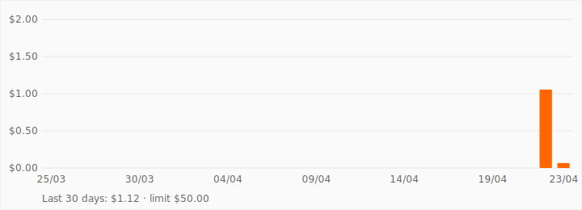
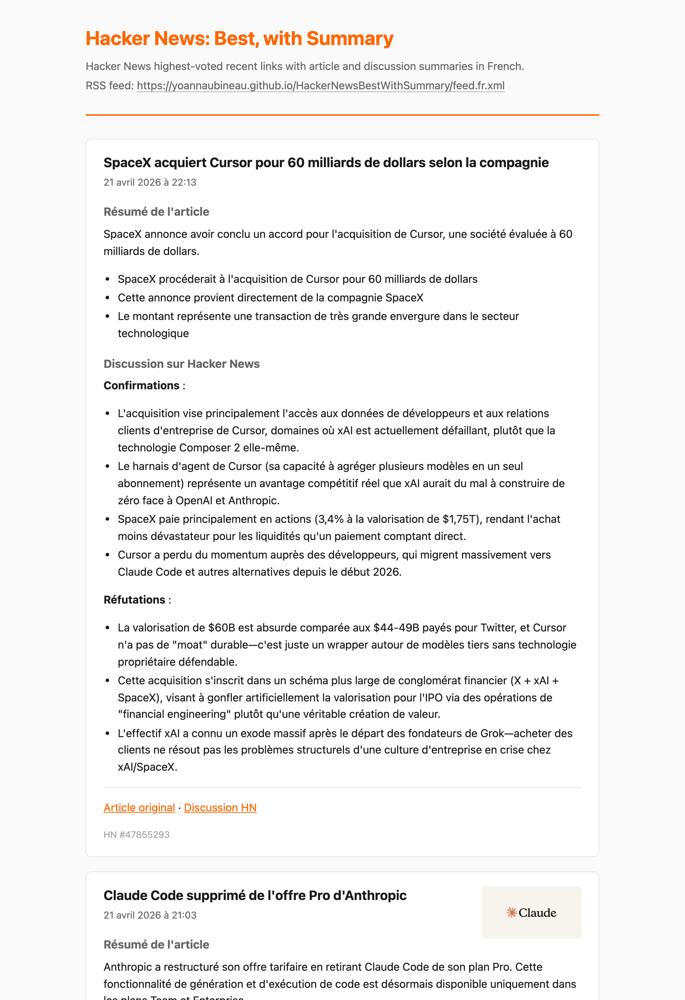

# Hacker News Best — with summaries

Republishes the [Hacker News Best](https://hnrss.org/best) feed, enriched with:

- a rewritten, factual title (clickbait headlines are replaced by what the article actually says)
- a summary of the linked article
- a synthesis of the main pro / con arguments from the Hacker News discussion

The generated feed is a static RSS 2.0 file, updated hourly by GitHub Actions and served through GitHub Pages.

## LLM Cost Supported by the Author



Daily spend on the `hn-best-summary` OpenRouter key over the last 30 days.
Refreshed each hour by the cycle workflow.

## Preview

Opening the feed URL in a browser renders a styled page via an embedded
XSLT stylesheet; RSS readers receive the same file as plain RSS 2.0.



## Subscribe

Feed URL (French summaries):

<https://yoannaubineau.github.io/HackerNewsBestWithSummary/feed.fr.xml>

## Set up your own instance

The project is MIT-licensed; feel free to fork it and run a copy under your
own Pages URL.

1. **Fork the repository** on GitHub.
2. **Create an OpenRouter account** at <https://openrouter.ai> and generate
   an API key. Add a few dollars of credit (or restrict yourself to the
   free-tier fallback models by setting `OPENROUTER_MODEL` to one of them).
3. **Add the API key as a GitHub Secret** named `OPENROUTER_API_KEY`
   under *Settings → Secrets and variables → Actions → New repository secret*.
4. **Switch GitHub Pages to workflow deployment**: *Settings → Pages →
   Build and deployment → Source: **GitHub Actions***.
5. **Trigger the cycle workflow once** (*Actions → cycle → Run workflow*)
   so the initial feed is built and deployed. The hourly cron takes over
   after that.

Estimated runtime cost at the default configuration: roughly **US$10–15 per
month** in OpenRouter credits (Claude Haiku 4.5 at ~10 new HN Best articles
per day). Free-tier fallback models remain available at zero cost if
OpenRouter rate-limits the primary.

## Run locally

### Prerequisites

- **uv** (Astral) — one-shot install: `curl -LsSf https://astral.sh/uv/install.sh | sh` (or `brew install uv`). Handles Python install, virtualenv, and deps.
- **xmllint** — ships with macOS; on Debian/Ubuntu `apt install libxml2-utils`. Only needed for the optional validation step below.
- An **OpenRouter API key**. Create a free account at <https://openrouter.ai>, generate a key (format `sk-or-v1-…`), and add a few dollars of credit if you want to use the paid primary model. Purely free-tier usage is possible by setting `OPENROUTER_MODEL` to one of the fallbacks (e.g. `meta-llama/llama-3.3-70b-instruct:free`).

### Setup

```bash
uv sync                      # install runtime + dev deps, matches uv.lock
cp .env.example .env         # then edit: OPENROUTER_API_KEY=sk-or-v1-...
```

### Run the full pipeline

```bash
uv run app cycle
```

Fetches new HN Best articles, extracts their content, pulls the HN
discussion, summarizes both via the LLM, regenerates
`artefacts/feed.fr.xml`. First run ingests ~30 articles at once, which
costs roughly **US$1–2** on Claude Haiku 4.5. Each later run only
processes genuinely new entries (typically 0–2 per hour).

### Inspect the generated feed in a browser

`file://` URLs don't apply the XSLT stylesheet reliably — serve the
folder over HTTP:

```bash
python -m http.server --directory artefacts 8000
# then open http://localhost:8000/feed.fr.xml
```

Validate the XML separately with `xmllint --noout artefacts/feed.fr.xml`.

### Work without spending LLM credits

Every pipeline step except `summarize` is free to call. Use a dummy
key to explore intermediate state:

```bash
OPENROUTER_API_KEY=dummy uv run app fetch-feed         # step 1: RSS → pending files
OPENROUTER_API_KEY=dummy uv run app fetch-articles     # step 2: HTTP + trafilatura
OPENROUTER_API_KEY=dummy uv run app fetch-discussions  # step 3: Algolia HN API
# step 4 (summarize) needs a real key
OPENROUTER_API_KEY=dummy uv run app publish            # step 5: regenerate feed.fr.xml
```

### Tests and lint

```bash
uv run pytest                          # full suite (~90 tests)
uv run ruff check src/ tests/          # lint
uv run ruff format src/ tests/         # auto-format
```

### Git hygiene after a local run

`uv run app cycle` writes new files under `artefacts/` that show up in
`git status`. On a fork you probably don't want to commit those — they
are produced again on every GitHub Actions cycle. If you're just
experimenting, either reset with `git checkout artefacts/` or ignore
the folder locally.

## Architecture

### Pipeline

An hourly workflow walks every new HN item through five sequential stages,
each of which only processes articles in a specific `status`. The pipeline
is crash-resumable — if a step fails halfway, the next cron run picks it up
where it left off.

1. **`fetch-feed`** polls `hnrss.org/best` and creates one Markdown file
   per HN item not yet seen, at
   `artefacts/articles/YYYY/MM/DD/{short_hash}.md` with `status: pending`.
   The filename is the first eight hex characters of SHA-256 of the HN
   guid, so paths are stable and re-runs are idempotent.
2. **`fetch-articles`** HTTP-fetches the linked URL, runs `trafilatura` to
   extract the main content, and captures the `og:image` /
   `twitter:image` metadata. Falls back to the feed's own summary if the
   URL isn't HTML or extraction returns nothing. → `status: article_fetched`.
3. **`fetch-discussions`** calls the Algolia HN API for the full comment
   tree and selects a recursive comment budget (default 500), degressively
   allocated to root threads ranked by HN score. The story submitter's
   own comments and their ancestor chain are always pinned — they carry
   clarifications that are otherwise easy to miss. → `status: discussion_fetched`.
4. **`summarize`** calls the LLM twice per article: once to produce both
   a rewritten factual title and a structured article summary (single
   prompt, single call), once to synthesise the discussion into
   `Confirmations` / `Réfutations` bullets. Each article gets up to three
   attempts with a cascading model fallback; after the third failure it
   moves to `artefacts/articles/_failed/…`. → `status: summarized`.
5. **`publish`** walks summarised articles newest-first (by `hn_item_id`
   desc), takes the top 200, and regenerates `artefacts/feed.fr.xml`.
   Only fires when at least one new summary was produced (or the feed
   file is missing). GitHub Pages redeploys the folder after the cycle
   commits.

Title rewriting and article summary share a single LLM call, so a full
cycle costs **two LLM calls per new article**, not three.

### Storage layout

Single source of truth is the filesystem, versioned by git — no database.

| Path | Contents |
|---|---|
| `artefacts/articles/YYYY/MM/DD/{short_hash}.md` | One article per file. YAML frontmatter holds all metadata (URLs, dates, `status`, image URL, model used, attempt count); the Markdown body holds the final summaries. |
| `artefacts/articles/_failed/…` | Articles that exceeded `MAX_ATTEMPTS`. Kept for history rather than deleted. |
| `artefacts/articles/**/*.raw.article.txt`, `*.raw.discussion.txt` | Transient sidecars holding raw source content between stages. **Gitignored** — copyright-sensitive and would bloat the repo. Cleared once the article reaches `summarized`. |
| `artefacts/feed.fr.xml` | The published RSS feed. |
| `artefacts/feed.xsl` | Client-side XSLT stylesheet applied by browsers when opening the feed URL directly. |

### Feed ordering

Items are sorted in the XML by `hn_item_id` descending. HN IDs are
strictly monotonic with submission time, which avoids any ambiguity
that parsed timestamps could introduce. `<pubDate>` carries
`source_published_at` (HN's own submission timestamp) so readers display
a real wall-clock time rather than "the moment our pipeline ingested the
article".

### Copyright stance

Only LLM-generated summaries, our own rewritten titles, and metadata
ever reach git or the public feed. The original article text is fetched
at runtime for the LLM prompt, kept in a gitignored sidecar for the
duration of the cycle, and deleted as soon as the summary is written.
HN comments are re-fetched from the public Algolia API each cycle and
are never stored either.

## Configuration

All settings are read from environment variables (locally from `.env`, in CI
from GitHub Secrets / workflow `env:`). Every value has a sensible default
except `OPENROUTER_API_KEY`.

| Variable | Default | Purpose |
|---|---|---|
| `OPENROUTER_API_KEY` | *required* | Auth token for OpenRouter. |
| `OPENROUTER_MODEL` | `anthropic/claude-haiku-4.5` | Primary LLM called for each summary. |
| `OPENROUTER_FALLBACK_MODELS` | `nvidia/nemotron-3-super-120b-a12b:free, meta-llama/llama-3.3-70b-instruct:free` | Comma-separated list of free fallbacks tried in order when the primary 429/5xx/empties. |
| `SOURCE_FEED_URL` | `https://hnrss.org/best` | Upstream RSS feed polled each cycle. |
| `FEED_SELF_URL` | `http://localhost/feed.fr.xml` | URL used for `<atom:link rel="self">`. Set to the public Pages URL in CI. |
| `FEED_ITEMS_LIMIT` | `200` | Maximum items kept in the output feed. |
| `FEED_TTL_MINUTES` | `15` | `<ttl>` advertised to polite readers — minimum polling interval in minutes. |
| `FEED_TITLE` | `Hacker News: Best, with Summary` | Channel `<title>`. |
| `FEED_DESCRIPTION` | (see `config.py`) | Channel `<description>`. |
| `CHANNEL_SITE_URL` | `https://news.ycombinator.com/best` | URL used for the channel's plain `<link>`. Readers resolve the feed's icon from this page's favicon. |
| `DISCUSSION_BUDGET` | `500` | Max number of HN comments sent to the LLM. Split recursively across root threads, decreasing by rank. |
| `LLM_SLEEP_SECONDS` | `3.0` | Pause between two LLM calls to stay under rate limits. |
| `HTTP_TIMEOUT` | `20.0` | Timeout in seconds for outbound HTTP calls. |
| `MAX_ATTEMPTS` | `3` | How many cycles an article may fail in a row before being moved to `_failed/`. |
| `USER_AGENT` | `hn-best-summary/0.1 (+...)` | Sent with every outbound HTTP request. |
| `ARTEFACTS_DIR` | `artefacts` | Root of all generated output. Article store, failed-article subfolder, and the feed file are all derived from this path. |
| `LOG_LEVEL` | `INFO` | One of `DEBUG`, `INFO`, `WARNING`, `ERROR`, `CRITICAL`. |

## Toolchain

### Language and packaging

| Tool | Role |
|---|---|
| **Python 3.12+** | Runtime for the pipeline. |
| **uv** (Astral) | Single binary that handles virtual environments, dependency resolution, Python installation, and script execution. Replaces `pip`, `venv`, and `pyenv`. |
| **pyproject.toml** | Project metadata, runtime and dev dependencies, and configuration for ruff and pytest. |
| **uv.lock** | Deterministic lockfile pinning every transitive dependency. |

### Code quality and tests

| Tool | Role |
|---|---|
| **ruff** (Astral) | Linter and formatter. Replaces flake8, black, isort. |
| **pytest** | Test runner. |
| **pytest-httpx** | Mocks HTTP calls in tests without touching the network. |

### Source control

| Tool | Role |
|---|---|
| **git** | Local version control, history, branching, reverts. |
| **GitHub** | Remote repository, collaboration, releases. |
| **gh** CLI | Scripted access to the GitHub API: workflow runs, PR merges, repo settings. |

### Runtime Python dependencies

| Library | Role |
|---|---|
| **httpx** | HTTP client used for every external call (source feed, articles, Algolia, OpenRouter). |
| **feedparser** | Parses the upstream RSS feed. |
| **trafilatura** | Extracts the main text content from article HTML. |
| **feedgen** | Builds the output RSS XML. |
| **markdown-it-py** | CommonMark renderer converting Markdown bodies to HTML for the feed description. Configured with `html=False` to escape raw HTML in model output. |
| **pydantic** + **pydantic-settings** | Typed data models (`Article`, `AlgoliaItem`) and environment-driven configuration. |
| **typer** | CLI framework backing the `app` command. |
| **tenacity** | Declarative retry with backoff for flaky network calls. |
| **structlog** | Structured logging with key/value pairs surfaced in workflow logs. |
| **python-frontmatter** | Reads and writes Markdown files with YAML frontmatter. |

### External services

| Service | Endpoint | Role |
|---|---|---|
| **hnrss.org** | `https://hnrss.org/best` | Upstream RSS source. |
| **Algolia HN Search API** | `https://hn.algolia.com/api/v1/items/{id}` | Public API returning the full comment tree for an HN item. |
| **OpenRouter** | `https://openrouter.ai/api/v1/chat/completions` | Gateway routing to the configured LLM with cascading fallback between providers. |
| **Anthropic Claude Haiku 4.5** | via OpenRouter | Default LLM used for title rewriting and both summaries. |
| Article publishers | per-article URL | Fetched to extract the article text. |

### Storage

| Choice | Rationale |
|---|---|
| **Filesystem + git** | Articles are Markdown files under `artefacts/articles/YYYY/MM/DD/{short_hash}.md`. Git provides history, idempotency (deterministic filename), and deployment in one. |
| **No database** | Unwarranted at this scale; the repository itself is the data layer. |
| **Gitignored sidecar files** | `.raw.article.txt` and `.raw.discussion.txt` cache raw content between pipeline stages and are never committed. |

### CI/CD

| Component | Role |
|---|---|
| **`.github/workflows/cycle.yml`** | Hourly cron plus manual `workflow_dispatch`. Runs the pipeline end-to-end and deploys to Pages. |
| **`.github/workflows/ci.yml`** | Runs ruff and pytest on every push to `main` and every pull request (skipped for commits that only touch `artefacts/`). |
| **Dependabot** | Weekly batched PRs for Python deps (via `uv`) and GitHub Actions versions; real-time PRs for security advisories. |

### Actions used in the workflows

| Action | Role |
|---|---|
| **`actions/checkout`** | Clones the repository into the runner. |
| **`astral-sh/setup-uv`** | Installs uv and caches its download directory across runs. |
| **`actions/configure-pages`** | Sets up the Pages environment and OIDC token for deployment. |
| **`actions/upload-pages-artifact`** | Packages the `artefacts/` folder as a Pages artifact. |
| **`actions/deploy-pages`** | Publishes the artifact to the Pages CDN. |

### Hosting and delivery

| Component | Role |
|---|---|
| **GitHub Pages** | Static hosting. Serves the contents of `artefacts/` at the site root. |
| **Fastly** | CDN underneath Pages. Handles edge caching and TLS. |

### Browser-side rendering

| Component | Role |
|---|---|
| **`artefacts/feed.xsl`** | XSLT 1.0 stylesheet applied by the browser when the feed URL is opened directly. Transforms the RSS into a styled HTML page. |
| **Browser-native XSLT engine** | Chrome, Firefox, and Safari all implement XSLT 1.0 client-side — no extra runtime required. |
| **Inline CSS** (in the stylesheet) | Light/dark theme via `prefers-color-scheme`, responsive single-column layout. |
| **Inline JavaScript** (in the stylesheet) | Appends the HN item ID to each article footer at render time, without touching the stored body. |

### Secrets

| Secret | Location |
|---|---|
| **`OPENROUTER_API_KEY`** (local) | `.env` at repo root (gitignored). Loaded by `pydantic-settings`. |
| **`OPENROUTER_API_KEY`** (production) | GitHub Secret injected into the cycle workflow as an environment variable. |
| **`GITHUB_TOKEN`** | Provided automatically by GitHub Actions, scoped to `contents: write`, `pages: write`, `id-token: write`. |

## License

MIT — see [LICENSE](LICENSE).
