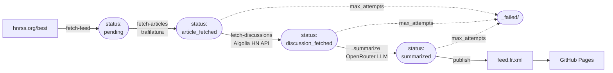

# Architecture and toolchain

How the pipeline is laid out and what it's built with.

## Architecture

### Pipeline

An hourly workflow walks every new HN item through five sequential stages,
each of which only processes articles in a specific `status`. The pipeline
is crash-resumable. If a step fails halfway, the next cron run picks it up
where it left off.

1. **`fetch-feed`** polls `hnrss.org/best` and creates one Markdown file
   per HN item not yet seen, at
   `artefacts/articles/YYYY/MM/DD/{short_hash}.md` with `status: pending`.
   The filename is the first eight hex characters of SHA-256 of the HN
   guid, so paths are stable and re-runs are idempotent.
2. **`fetch-articles`** HTTP-fetches the linked URL, runs `trafilatura` to
   extract the main content, and captures the `og:image` /
   `twitter:image` metadata. Falls back to the feed's own summary if the
   URL isn't HTML or extraction returns nothing. Pages that only serve a
   "JavaScript required" shell (Mastodon, X/Twitter, Reddit, and other
   SPA-only sites) are detected by fuzzy-matching trafilatura's output
   against the raw HTML's `<noscript>` block, and flagged
   `content_source: js_required` with no stored body text. When the URL
   points to a YouTube video (`youtube.com/watch`, `youtu.be`, `shorts`,
   `embed`, or `v`), the HTTP fetch is skipped entirely and the pipeline
   pulls the video transcript via `youtube-transcript-api` (preferring
   French then English, auto-generated captions accepted), stored with
   `content_source: video_transcript`. A fresh `img.youtube.com`
   thumbnail is always used as `image_url`, so the feed card still gets
   an illustration even when the transcript fetch fails.
   → `status: article_fetched`.
3. **`fetch-discussions`** calls the Algolia HN API for the full comment
   tree and selects a recursive comment budget (default 500), degressively
   allocated to root threads ranked by HN score. The story submitter's
   own comments and their ancestor chain are always pinned, since they
   carry clarifications that are otherwise easy to miss. The same step
   also scrapes the HN HTML page (`news.ycombinator.com/item?id=<id>`)
   to recover the display order of top-level comments, which Algolia
   does not preserve and which HN never exposes as a numeric score. The
   first three valid IDs in that order become the verbatim
   "Commentaires les plus plébiscités" block rendered later in the
   feed. → `status: discussion_fetched`.
4. **`summarize`** calls the LLM twice per article: once to produce both
   a rewritten factual title and a structured article summary (single
   prompt, single call), once to synthesise the discussion into
   `Avis positifs` / `Avis négatifs` bullets. Articles flagged
   `js_required` skip the article-summary call altogether and fall back
   to a cheap title-translation call plus a `(no content)` placeholder
   under the article-summary heading, while the discussion synthesis
   runs as usual. Each article gets up to three attempts with a
   cascading model fallback, after which it moves to
   `artefacts/articles/_failed/…`. → `status: summarized`.
5. **`publish`** walks summarised articles newest-first (by `hn_item_id`
   desc), takes the top 100, and regenerates `artefacts/feed.fr.xml`.
   Only fires when at least one new summary was produced (or the feed
   file is missing). GitHub Pages redeploys the folder after the cycle
   commits.

Title rewriting and article summary share a single LLM call, so a full
cycle costs **two LLM calls per new article**, not three.

### Storage layout

Single source of truth is the filesystem, versioned by git, with no database.

| Path | Contents |
|---|---|
| `artefacts/articles/YYYY/MM/DD/{short_hash}.md` | One article per file. YAML frontmatter holds all metadata (URLs, dates, `status`, image URL, model used, attempt count). The Markdown body holds the final summaries. |
| `artefacts/articles/_failed/…` | Articles that exceeded `MAX_ATTEMPTS`. Kept for history rather than deleted. |
| `artefacts/articles/**/*.raw.article.txt`, `*.raw.discussion.txt`, `*.raw.top_comments.txt` | Transient sidecars holding raw source content (or the pre-rendered top-comments block) between stages. **Gitignored** because they are copyright-sensitive and would bloat the repo. Cleared once the article reaches `summarized`. |
| `artefacts/feed.fr.xml` | The published RSS feed. |
| `artefacts/feed.xsl` | Client-side XSLT stylesheet applied by browsers when opening the feed URL directly. |

### Feed ordering

Items are sorted in the XML by `hn_item_id` descending. HN IDs are
strictly monotonic with submission time, which avoids any ambiguity
that parsed timestamps could introduce. `<pubDate>` carries
`source_published_at` (HN's own submission timestamp) so readers display
a real wall-clock time rather than "the moment our pipeline ingested the
article".

### Copyright stance

Only LLM-generated summaries, our own rewritten titles, and metadata
ever reach git or the public feed. The original article text is fetched
at runtime for the LLM prompt, kept in a gitignored sidecar for the
duration of the cycle, and deleted as soon as the summary is written.
HN comments are re-fetched from the public Algolia API each cycle and
are never stored either.

## Toolchain

### Language and packaging

| Tool | Role |
|---|---|
| **Python 3.12+** | Runtime for the pipeline. |
| **uv** (Astral) | Single binary that handles virtual environments, dependency resolution, Python installation, and script execution. Replaces `pip`, `venv`, and `pyenv`. |
| **pyproject.toml** | Project metadata, runtime and dev dependencies, and configuration for ruff and pytest. |
| **uv.lock** | Deterministic lockfile pinning every transitive dependency. |

### Code quality and tests

| Tool | Role |
|---|---|
| **ruff** (Astral) | Linter and formatter. Replaces flake8, black, isort. |
| **pytest** | Test runner. |
| **pytest-httpx** | Mocks HTTP calls in tests without touching the network. |

### Source control

| Tool | Role |
|---|---|
| **git** | Local version control, history, branching, reverts. |
| **GitHub** | Remote repository, collaboration, releases. |
| **gh** CLI | Scripted access to the GitHub API: workflow runs, PR merges, repo settings. |

### Runtime Python dependencies

| Library | Role |
|---|---|
| **httpx** | HTTP client used for every external call (source feed, articles, Algolia, OpenRouter). |
| **feedparser** | Parses the upstream RSS feed. |
| **trafilatura** | Extracts the main text content from article HTML. |
| **feedgen** | Builds the output RSS XML. |
| **markdown-it-py** | CommonMark renderer converting Markdown bodies to HTML for the feed description. Configured with `html=False` to escape raw HTML in model output. |
| **pydantic** + **pydantic-settings** | Typed data models (`Article`, `AlgoliaItem`) and environment-driven configuration. |
| **typer** | CLI framework backing the `app` command. |
| **tenacity** | Declarative retry with backoff for flaky network calls. |
| **structlog** | Structured logging with key/value pairs surfaced in workflow logs. |
| **python-frontmatter** | Reads and writes Markdown files with YAML frontmatter. |
| **youtube-transcript-api** | Pulls auto-generated and human transcripts for YouTube videos, with optional Webshare residential proxy. |

### External services

| Service | Endpoint | Role |
|---|---|---|
| **hnrss.org** | `https://hnrss.org/best` | Upstream RSS source. |
| **Algolia HN Search API** | `https://hn.algolia.com/api/v1/items/{id}` | Public API returning the full comment tree for an HN item. |
| **Hacker News (HTML)** | `https://news.ycombinator.com/item?id={id}` | Scraped once per article to read the rendered display order of top-level comments. Per-comment scores are not exposed by any HN API, and Algolia returns children chronologically rather than by HN's best ranking, so the HTML page is the only source of truth for the order. The direct call retries up to three times on HTTP 429 / connection errors with exponential backoff, then falls back to one last attempt through the Webshare residential proxy below if its credentials are configured (HN often rate-limits shared GitHub Actions IPs even on a first request). |
| **OpenRouter** | `https://openrouter.ai/api/v1/chat/completions` | Gateway routing to the configured LLM with cascading fallback between providers. |
| **Anthropic Claude Haiku 4.5** | via OpenRouter | Default LLM used for title rewriting and both summaries. |
| Article publishers | per-article URL | Fetched to extract the article text. |
| **YouTube** | `youtube.com`, `img.youtube.com` | Scraped by `youtube-transcript-api` for video transcripts and used directly for thumbnails. |
| **Webshare residential proxy** | `p.webshare.io:80` | Optional outbound proxy for YouTube transcript requests (YouTube blocks GitHub Actions datacenter IPs outright) and a last-resort fallback for the HN HTML scrape when direct calls exhaust their retries (HN frequently rate-limits the same shared IPs). |

### Storage

| Choice | Rationale |
|---|---|
| **Filesystem + git** | Articles are Markdown files under `artefacts/articles/YYYY/MM/DD/{short_hash}.md`. Git provides history, idempotency (deterministic filename), and deployment in one. |
| **No database** | Unwarranted at this scale. The repository itself is the data layer. |
| **Gitignored sidecar files** | `.raw.article.txt`, `.raw.discussion.txt`, and `.raw.top_comments.txt` cache raw content (or the pre-rendered top-comments markdown) between pipeline stages and are never committed. |

### CI/CD

| Component | Role |
|---|---|
| **`.github/workflows/cycle.yml`** | Hourly cron plus manual `workflow_dispatch`. Runs the pipeline end-to-end and deploys to Pages. |
| **`.github/workflows/ci.yml`** | Runs ruff and pytest on every push to `main` and every pull request (skipped for commits that only touch `artefacts/`). |
| **Dependabot** | Weekly batched PRs for Python deps (via `uv`) and GitHub Actions versions, plus real-time PRs for security advisories. |

### Actions used in the workflows

| Action | Role |
|---|---|
| **`actions/checkout`** | Clones the repository into the runner. |
| **`astral-sh/setup-uv`** | Installs uv and caches its download directory across runs. |
| **`actions/configure-pages`** | Sets up the Pages environment and OIDC token for deployment. |
| **`actions/upload-pages-artifact`** | Packages the `artefacts/` folder as a Pages artifact. |
| **`actions/deploy-pages`** | Publishes the artifact to the Pages CDN. |

### Hosting and delivery

| Component | Role |
|---|---|
| **GitHub Pages** | Static hosting. Serves the contents of `artefacts/` at the site root. |
| **Fastly** | CDN underneath Pages. Handles edge caching and TLS. |

### Browser-side rendering

| Component | Role |
|---|---|
| **`artefacts/feed.xsl`** | XSLT 1.0 stylesheet applied by the browser when the feed URL is opened directly. Transforms the RSS into a styled HTML page. |
| **Browser-native XSLT engine** | Chrome, Firefox, and Safari all implement XSLT 1.0 client-side, so no extra runtime is required. |
| **Inline CSS** (in the stylesheet) | Light/dark theme via `prefers-color-scheme`, responsive single-column layout. |
| **Inline JavaScript** (in the stylesheet) | Appends the HN item ID to each article footer at render time, without touching the stored body. |

### Secrets

| Secret | Location |
|---|---|
| **`OPENROUTER_API_KEY`** (local) | `.env` at repo root (gitignored). Loaded by `pydantic-settings`. |
| **`OPENROUTER_API_KEY`** (production) | GitHub Secret injected into the cycle workflow as an environment variable. |
| **`WEBSHARE_PROXY_USERNAME`**, **`WEBSHARE_PROXY_PASSWORD`** | Optional GitHub Secrets. Forwarded to the cycle workflow so YouTube transcript requests can tunnel through Webshare's residential pool. Leave unset to skip the proxy (fine from a non-blocked home IP). |
| **`GITHUB_TOKEN`** | Provided automatically by GitHub Actions, scoped to `contents: write`, `pages: write`, `id-token: write`. |
